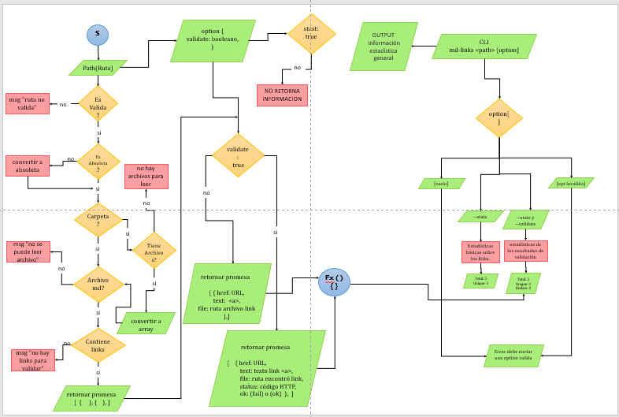

# ⚙️Markdown Links⚙️

## Índice

* [1. Preámbulo](#1-preámbulo)
* [2. Resumen del proyecto](#2-resumen-del-proyecto)
* [3. Diagrama de flujo](#3-diagrama-de-flujo)
* [4. Instalación](#4-instalación)
* [5. Guía](#5-guía)
* [6. Tecnologias usadas](#6-tecnologías-usadas)
* [7. Autor](#7-Autor)
***

## 1. Preámbulo 👀

[Markdown](https://es.wikipedia.org/wiki/Markdown) es un lenguaje de marcado
ligero muy popular entre developers. Es usado en muchísimas plataformas que
manejan texto plano (GitHub, foros, blogs, ...) y es muy común
encontrar varios archivos en ese formato en cualquier tipo de repositorio
(empezando por el tradicional `README.md`).

Estos archivos `Markdown` normalmente contienen _links_ (vínculos/ligas) que
muchas veces están rotos o ya no son válidos y eso perjudica mucho el valor de
la información que se quiere compartir.

Dentro de una comunidad de código abierto, nos han propuesto crear una
herramienta usando [Node.js](https://nodejs.org/), que lea y analice archivos
en formato `Markdown`, para verificar los links que contengan y reportar
algunas estadísticas.

## 2. Resumen del proyecto 📄

Es una herramienta de línea de comando(CLI) y una librería, que permite extraer los links de un archivo tipo Markdown(md), identifica los links que esten dentro de dichos archivos, y evalua cuales están funcionando y cuales están rotos. Adicionalmente entrega esta información al usuario como estadísticas, de la siguiente información:

  *Total de links* <br>
  *Links únicos* <br>
  *Links rotos* <br>

## 3. Diagrama de flujo 📊

Para llevar a  cabo este proyecto se hizo necesario elaborar un diagrama de flujo, el cual muestra el paso a paso del paquete creado y lo que se queria obtener de él.




## 4. Instalación 🛠️

Para hacer uso de la librería ejecuta en la terminal el siguiente comando: 
  ```
  npm install mdlinks-Ximena-21
  ```

luego deberas, de ejecutar el siguiente comando para que el ejecutable sea leido
  ```
  npm link
  ```


## 5. Guía 📝 

Para utilizar esta librería puedes ejecutar los siguientes comandos, desde la terminal: 
  ```
 md-links <path> <options>
 ```

- options puede ser:

1. Si necesitas conocer y validar los link encontrados en archivos .md:
   ```
   md-links <path> --validate o --v
   ```

  ***Devuelve:***

*{*<br>
    *`href`: URL encontrada.*<br>
    *`text`: Texto que aparecía dentro del link (`<a>`).*<br>
    *`file`: Ruta del archivo donde se encontró el link.*<br>
    *`status`: Código de respuesta HTTP.*<br>
    *`ok`: Mensaje `fail` en caso de fallo u `ok` en caso de éxito.*<br>
 *}*

2. Si necesitas conocer estadistica de cuantos link  se encontraron y cuantos son únicos:
    ```
   md-links <path> --stats o --s
   ```

   ***Devuelve:***

  *Total: 3 ; Unique: 3*

3. Si necesitas conocer, validar los link y devolver una estadisticas con los links rotos:
   ```
   *md-links <path> --validate --stats o --v --s*
   ```

   ***Devuelve:***

  *Total: 3 ; Unique: 3 ; Broken: 1*

4. si solo deseas conocer los link encontrados y donde fueron encontrados, ingresa:
   ```
   md-links <path>
   ```

   ***Devuelve:***

*{*<br>
    *`href`: URL encontrada.*<br>
    *`text`: Texto que aparecía dentro del link (`<a>`).*<br>
    *`file`: Ruta del archivo donde se encontró el link.*<br>
*}*

## 6. Tecnologias usadas 💻
* [Node](https://nodejs.org/es/) - Utilizado para ejecutar javascript en consola
* [JAVASCRIPT](https://developer.mozilla.org/es/docs/Web/JavaScript) - Lenguaje de programación
* [GitHub](https://github.com/)- Usado guardar el repositorio del proyecto

## 7. Autor 🖋️
* **Paula Ximena Anzola** - [Ximena-21](https://github.com/Ximena-21) 
